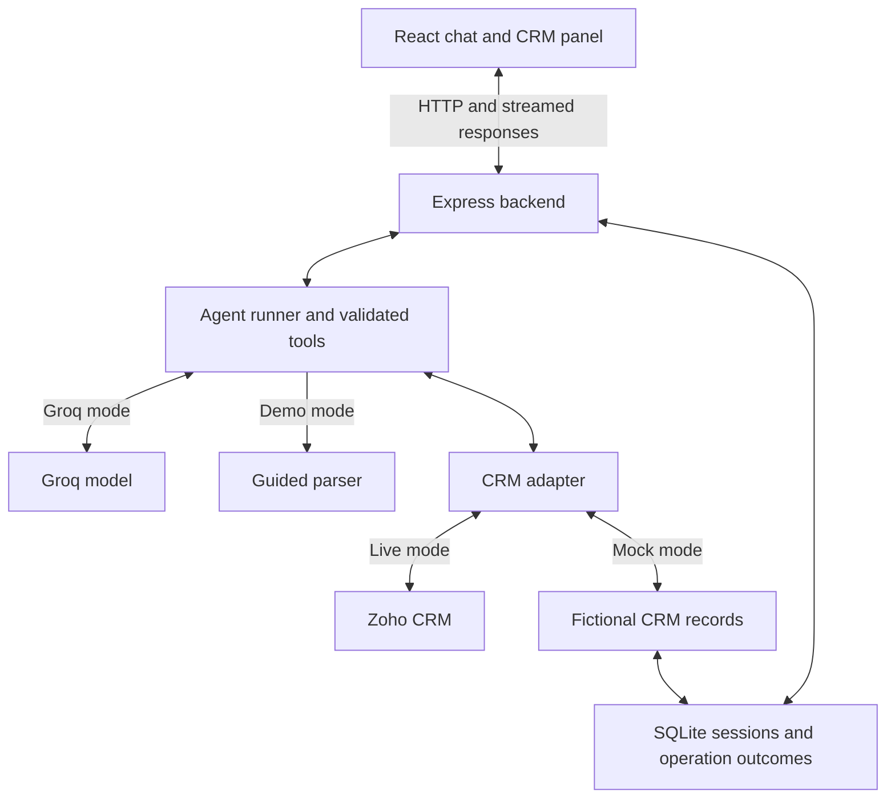
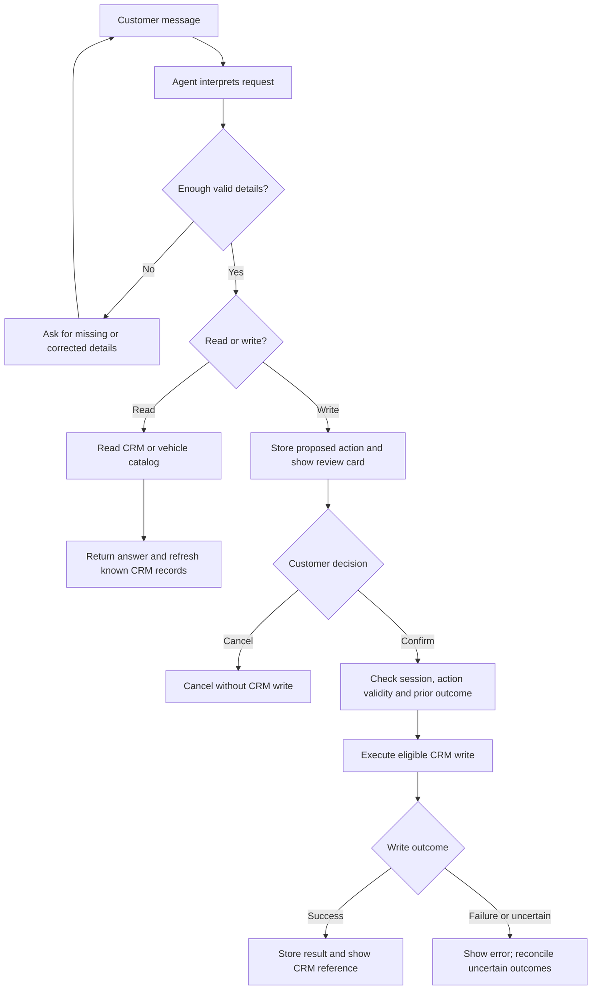
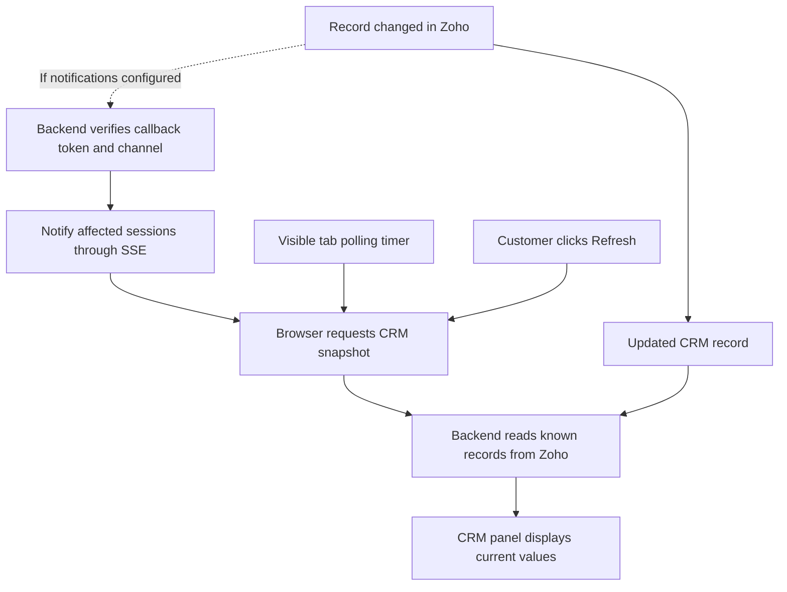

# Automotive AI Agent — ABC Automotive

A React and Node.js conversational application for vehicle enquiries, sales follow-ups, booking tracking, and service requests. Groq provides model tool calling, and Zoho CRM stores Leads, Contacts, Deals, and Cases. Writes require the user to review and confirm the proposed action.

This guide lets a new developer clone the repository and run it locally, starting with a demo that needs no API keys and then optionally connecting their own Groq and Zoho accounts.

## Contents

- [Prerequisites](#prerequisites)
- [Clone and run locally](#clone-and-run-locally)
- [Modes](#modes)
- [Environment variables](#environment-variables)
- [Flow diagrams](#flow-diagrams)
- [Project structure](#project-structure)
- [Four demo scenarios](#four-demo-scenarios)
- [Live Zoho setup](#live-zoho-setup)
- [Local production build](#local-production-build)
- [Commands](#commands)
- [Verification checklist](#verification-checklist)
- [Troubleshooting](#troubleshooting)
- [Limits and deployment scope](#limits-and-deployment-scope)

## Prerequisites

| Requirement | Details |
| --- | --- |
| Node.js | Version 22.13.0 or newer, as required by `package.json`; uses built-in `node:sqlite` |
| npm | Installed with Node; use the committed lockfile for dependencies |
| Git | Required for cloning; not required if extracting a ZIP |
| Browser | A modern desktop or mobile browser |
| Internet | Required to install dependencies and for Groq/Zoho; demo runtime does not need those external APIs |
| Groq account | Only needed for `LLM_MODE=groq` |
| Zoho CRM account | Only needed for `CRM_MODE=zoho`; must have API access, required modules, customization permissions, and sufficient API quota |

No separate MongoDB, PostgreSQL, Python, Docker, or SQLite installation is required.

Check your installed versions:

```bash
node --version
npm --version
git --version
```

Install Node from [nodejs.org](https://nodejs.org/) if necessary. After installation, reopen your terminal. Commands below can run in Ubuntu/macOS terminals or Windows PowerShell unless marked otherwise.

## Clone and run locally

### 1. Get the project

Replace `YOUR_REPOSITORY_URL` below with the actual repository clone URL. It is a placeholder, not a working repository address.

```bash
git clone YOUR_REPOSITORY_URL automotive-ai-agent
cd automotive-ai-agent
```

Alternatively, extract the project ZIP and open a terminal in the folder containing `package.json`, `package-lock.json`, `apps`, and `scripts`.

### 2. Create the environment and install dependencies

```bash
npm run setup
npm ci
```

`setup` copies `.env.example` to `.env` only if `.env` does not already exist. It preserves existing settings. `npm ci` installs both workspaces from the root lockfile; do not install each application separately.

The initial settings should be:

```dotenv
CRM_MODE=mock
LLM_MODE=demo
HOST=127.0.0.1
PORT=4000
CRM_POLL_INTERVAL_MS=30000
```

### 3. Start both applications

```bash
npm run dev
```

Keep this terminal open. The command starts the backend and Vite together.

- Frontend: [http://127.0.0.1:5173](http://127.0.0.1:5173)
- Backend health: [http://127.0.0.1:4000/api/health](http://127.0.0.1:4000/api/health)

Open the frontend in your browser. The health endpoint should report the configured modes. Check the terminal's actual frontend URL if port 5173 was already occupied.

To stop, press **Ctrl+C**. To start again, run `npm run dev` from the project root. Changes to `.env` require a backend restart; stopping and restarting the combined command is simplest.

### 4. Try the demo

Send this message:

```text
Check my existing deal. My phone is 9000000002.
```

The fictional Priya deal should appear. Use the full scenarios below to test all four flows.

> When switching between mock CRM and live Zoho, click **+ New conversation**. Old conversations may contain mock identifiers that are invalid in Zoho.

## Modes

| CRM_MODE | LLM_MODE | Purpose |
| --- | --- | --- |
| `mock` | `demo` | Default; deterministic guided parser, fictional persistent CRM, no keys |
| `mock` | `groq` | Real model tool calling with fictional CRM; useful before connecting Zoho |
| `zoho` | `groq` | Live AI and live CRM; required for final company demonstration |

The guided parser is **not an AI model**. It accepts the example messages below and semicolon-separated labeled details. The Groq mode supports natural language and multi-step tool use. `zoho + demo` is deliberately rejected so the final integration is not mistaken for a live AI test.

Enable the real model in `.env`:

```dotenv
LLM_MODE=groq
GROQ_API_KEY=your_key_here
GROQ_MODEL=openai/gpt-oss-20b
CRM_MODE=mock
```

Restart the backend after editing `.env`. Model access and free-tier quotas depend on your Groq account; select a currently available tool-capable model if necessary. The model ID is configurable. See [Groq's models](https://console.groq.com/docs/models) and [tool calling](https://console.groq.com/docs/tool-use/local-tool-calling).

## Environment variables

Keep `.env` at the project root. Use `.env.example` as the template, and supply your own credentials. Values below are defaults or explanations, not real credentials.

| Variable | Default / purpose |
| --- | --- |
| `HOST` | `127.0.0.1`; local backend binding |
| `PORT` | `4000`; backend port |
| `CRM_MODE` | `mock` or `zoho` |
| `LLM_MODE` | `demo` or `groq` |
| `GROQ_API_KEY` | Required for Groq mode; obtain from your Groq console |
| `GROQ_MODEL` | `openai/gpt-oss-20b`; requires access to a tool-capable model |
| `GROQ_BASE_URL` | `https://api.groq.com/openai/v1` |
| `ZOHO_ACCOUNTS_URL` | `https://accounts.zoho.in`; use your account's data center |
| `ZOHO_API_DOMAIN` | `https://www.zohoapis.in`; use the matching CRM environment/domain |
| `ZOHO_CLIENT_ID` | OAuth client ID for live CRM |
| `ZOHO_CLIENT_SECRET` | OAuth client secret for live CRM |
| `ZOHO_REFRESH_TOKEN` | Long-lived credential used by the backend to obtain access tokens |
| `ZOHO_FIELD_MAP_FILE` | Optional JSON override path relative to project root |
| `ZOHO_PIPELINE` | Optional exact pipeline value when required by your organization |
| `ZOHO_BOOKED_STAGE` | `Closed Won - Booking Done`; must match your configured stage |
| `CRM_POLL_INTERVAL_MS` | `30000`; fallback refresh interval in milliseconds; `0` disables polling |
| `PUBLIC_BASE_URL` | Public HTTPS base URL for optional Zoho callbacks; no callback path suffix |
| `ZOHO_WEBHOOK_TOKEN` | Random secret of 32–50 characters for callback verification |
| `ZOHO_CHANNEL_ID` | `10001`; numeric notification channel ID |
| `PAYMENT_ALLOWED_HOSTS` | Comma-separated exact HTTPS hostnames allowed for CRM payment links; empty means no approved hosts |
| `DB_PATH` | Optional backend override; default `apps/server/data/app.sqlite`; an absolute path avoids working-directory ambiguity |

Do not put secrets in React code or variables prefixed with `VITE_`. Do not commit `.env`, API tokens, local database files, or screenshots containing credentials.

## Flow diagrams

These Mermaid diagrams describe the application's main flows. Open this README in a Markdown viewer with Mermaid support to see the rendered diagrams.

### Application architecture

The browser calls the backend. The backend manages model calls, validates tools, and accesses CRM; credentials stay on the server.



Groq chooses tool calls; the backend controls execution. Demo mode uses a deterministic parser rather than an LLM. SQLite persists local conversation and operation state in both modes.

### Conversation and confirmation flow

Reads can run immediately. Creating a lead or case, or changing a follow-up preference, requires a review card and confirmation.



Confirmation uses the server-held action, not replacement values supplied by the browser. Repeating a successful confirmation returns its stored outcome. An uncertain write is not blindly replayed.

### Four customer journeys

| Journey | Information collected or searched | CRM operation |
| --- | --- | --- |
| Discover a vehicle | Vehicle interest, name, phone, email, city | Read catalog; create or find Lead after the applicable confirmation flow |
| Sales follow-up | Customer phone and chosen deal | Read Deal; confirm a Follow Up Preference update |
| Track a booking | Booking ID | Read confirmed Deal, allocation stage and delivery estimate |
| Vehicle service | Contact phone, registration, odometer, issue, location, service type | Find Contact; confirm creation of a linked Case |

### Zoho-to-app synchronization

Polling works locally. Optional webhooks require a public HTTPS callback and a valid notification subscription. Both paths refresh records already associated with the conversation.



The default polling interval is 30 seconds. Automatic panel updates do not rewrite previous chat messages; a new status question reads current CRM data. A successful polling test does not by itself prove that webhooks are configured.

## Project structure

| Path | Responsibility |
| --- | --- |
| `apps/web/src/main.jsx` | Responsive React chat, lifecycle navigation, confirmation cards, CRM context panel |
| `apps/web/src/api.js` | Bearer session handling, JSON API calls, SSE stream parsing |
| `apps/web/src/styles.css` | Desktop/mobile styling, focus states and reduced-motion support |
| `apps/server/src/app.js` | Express routes, bearer checks, rate limits, SSE, webhook validation |
| `apps/server/src/config.js` | Backend environment configuration and startup checks |
| `apps/server/src/store.js` | SQLite sessions, CRM fixtures, operation outcomes and serialization |
| `apps/server/src/agent/prompt.js` | Four-stage behavior and domain constraints |
| `apps/server/src/agent/runner.js` | Bounded model → tool → result → model loop |
| `apps/server/src/agent/groq.js` | Groq streaming HTTP integration, fragmented tool arguments, timeouts |
| `apps/server/src/agent/tools.js` | Tool schemas, dispatch, pending actions and confirmed CRM writes |
| `apps/server/src/agent/validation.js` | Required values, Indian phone, email and service validation |
| `apps/server/src/agent/demo.js` | Offline guided conversation parser |
| `apps/server/src/crm/zoho.js` | OAuth refresh, CRM reads/searches/writes and error handling |
| `apps/server/src/crm/fields.js` | Explicit domain-to-Zoho field mapping |
| `apps/server/src/crm/mock.js` | Persistent local CRM implementation with the same interface |
| `apps/server/src/data/` | Fictional customer fixtures and synthetic vehicle catalog |
| `apps/server/tests/` | Workflow, HTTP, streaming and CRM contract tests |
| `scripts/` | Environment setup, development runner, Zoho field check/seed/notification commands |
| `docs/` | Architecture, Zoho setup, API reference, demo script, validation and submission checklist |
| `.env.example` | All required and optional configuration keys |
| `package-lock.json` | Reproducible dependency versions |

## Four demo scenarios

Use the sidebar to change stages, or type these messages. Lead details and service details can be collected across multiple turns. The full labeled examples make the offline parser reproducible.

### 1. New lead

```text
I am interested in Thar. Tell me about its features and price.
```

```text
name: Demo Customer; phone: 9000000004; email: demo.customer@example.com; city: Pune; vehicle: Thar
```

Review the card and click **Confirm & save**. A Lead is created with the vehicle custom field. Reusing the phone finds the existing lead. Saving a lead expresses interest; it does not guarantee a test-drive appointment.

### 2. Ongoing pipeline

```text
Check my existing deal. My phone is 9000000002.
```

```text
follow-up: WhatsApp after 6 PM
```

The agent reads the active deal, quote, dealer details, and test-drive time. Confirming the second message updates the follow-up preference. Times in seeded records are ISO UTC; the live agent is instructed to clarify timezone.

### 3. Booked vehicle

```text
What is the delivery status of booking MAH-9921?
```

The agent returns the booking deal's allocation stage and estimated delivery date. VIN and payment link are absent in the fixtures, so neither is invented. A payment link may only be displayed if its exact HTTPS hostname is in `PAYMENT_ALLOWED_HOSTS`.

Open **Demo guide & CRM update** in the right panel and change the booking allocation to `Delivered`. The panel refreshes through an SSE event. Ask the delivery question again and the agent reads the updated CRM record. In live mode, make this edit directly in the Zoho dashboard. Keep the app tab visible to test the default polling, or configure the optional webhook below.

### 4. Post-purchase service

```text
I need periodic maintenance. My phone is 9000000003.
```

```text
registration: MH12AB1234; odometer: 15000; issue: Routine maintenance; location: Pune; service type: Periodic maintenance
```

The Contact is found before a Case is proposed. Confirming creates a Case linked to that Contact, including registration, odometer, issue, service type, and preferred location. The case is a request; the service center confirms the appointment separately.

All example names, numbers, dealers, vehicle configurations and prices are fictional test data. Do not call the fixture numbers. The catalog does not claim current OEM pricing or specifications. Replace it with an approved OEM source before a real customer rollout.

## Live Zoho setup

Use a fictional developer organization for the assessment. This guide configures the exact field map shipped with the project. Organization editions, custom-field availability, required layouts and picklist values can differ; `zoho:check` reports actual metadata. If the free organization does not expose required modules/customization/API access, use an eligible developer environment or trial and confirm this with the evaluator.

### 1. Create credentials in the correct region

Sign up for Zoho CRM and open the API Console linked to the same data center. Create a **Self Client**. Generate an authorization code with these assessment scopes:

```text
ZohoCRM.modules.ALL,ZohoCRM.settings.ALL,ZohoCRM.notifications.ALL
```

The BRD includes modules/settings scopes. The extra notifications scope is needed for the bidirectional callback subscription. For a production client, narrow scopes to the actual modules and operations.

Use the CRM organization that should contain the fixtures when generating the code. Copy the Client ID and Client Secret from the Self Client's credentials tab. The generated code expires quickly: exchange it within the validity shown by the console.

In Postman, create a **POST** request to the following URL, choose **Body → x-www-form-urlencoded**, and add the four rows shown below (without literal angle brackets). Keep the response private. Exchange the short-lived code through your region's accounts service:

```text
POST https://accounts.zoho.in/oauth/v2/token
Content-Type: application/x-www-form-urlencoded

grant_type=authorization_code
client_id=<your-client-id>
client_secret=<your-client-secret>
code=<your-short-lived-code>
```

From the successful JSON response, copy `refresh_token` into `.env`. Do not put the generated authorization code or `access_token` into `ZOHO_REFRESH_TOKEN`. The backend refreshes access tokens automatically. If the code is expired or already used, generate a new one.

Use your client registration's redirect URI if required for that client type. Store `refresh_token`, `client_id`, and `client_secret` only in the backend `.env`. Avoid putting credentials into query strings or sharing the response in a screenshot.

```dotenv
CRM_MODE=zoho
LLM_MODE=groq
GROQ_API_KEY=your_groq_key
ZOHO_ACCOUNTS_URL=https://accounts.zoho.in
ZOHO_API_DOMAIN=https://www.zohoapis.in
ZOHO_CLIENT_ID=your_client_id
ZOHO_CLIENT_SECRET=your_client_secret
ZOHO_REFRESH_TOKEN=your_refresh_token
```

The `.in` values are India examples, not universal endpoints. Use `.com` for US or the appropriate domains for your region. Match production, developer or sandbox environment endpoints and credentials. The adapter uses the configured API domain so a callback cannot redirect an authenticated request.

Official references: [OAuth](https://www.zoho.com/crm/developer/docs/api/v8/oauth-overview.html), [authorization request](https://www.zoho.com/crm/developer/docs/api/v8/auth-request.html), [refresh tokens](https://www.zoho.com/crm/developer/docs/api/v8/refresh.html).

### 2. Configure fields and picklists

Use **field API names**, not just labels. Confirm them in Setup → Developer Hub / APIs → API Names, or inspect field metadata. Menu labels may differ by account.

Existing standard mappings:

| Module | Application values | Standard field API names |
| --- | --- | --- |
| Leads | fullName, phone, email, city, status | `Last_Name`, `Phone`, `Email`, `City`, `Lead_Status` |
| Contacts | fullName, phone, email | `Last_Name`, `Phone`, `Email` |
| Deals | name, stage, quote, contactId | `Deal_Name`, `Stage`, `Amount`, `Contact_Name` |
| Cases | subject, description, status, origin, contactId | `Subject`, `Description`, `Status`, `Case_Origin`, `Related_To` |

For simplicity, the complete entered name is written into `Last_Name`, a required standard field. Read responses prefer `Full_Name` when Zoho supplies it. In Cases, verify that `Related_To` is the Contact lookup in your organization; use the override mechanism if its API name differs.

In Zoho, open **Setup → Customization → Modules and Fields → the module → Layouts → Standard**. Drag a field type into the layout, set its label, and save the layout. Edit the existing Standard layout rather than creating a second layout unless you intend to maintain multiple layouts. For labels, replace underscores in the API names below with spaces (for example, `Vehicle_Model` → `Vehicle Model`). Verify the generated API name; labels alone are insufficient.

Create these custom fields:

| Module | Field API name | Type and setup |
| --- | --- | --- |
| Leads | `Vehicle_Model` | Single line or picklist: Thar, XUV700, Scorpio-N |
| Leads | `Agent_Request_ID` | Single line, unique/no duplicates; stores UUID operation key |
| Deals | `Customer_Phone` | Phone or single line; canonical 10-digit Indian mobile |
| Deals | `Vehicle_Model` | Single line or same vehicle picklist |
| Deals | `Test_Drive_At` | Date/time |
| Deals | `Dealer_Contact` | Single line or multiline |
| Deals | `Follow_Up_Preference` | Single line, length at least 200 |
| Deals | `Booking_ID` | Single line, unique; e.g. MAH-9921 |
| Deals | `Allocation_Stage` | Picklist: Dispatch Pending, In Transit, Delivered |
| Deals | `Expected_Delivery_Date` | Date |
| Deals | `VIN` | Single line |
| Deals | `Balance_Payment_Link` | URL |
| Cases | `Vehicle_Registration` | Single line |
| Cases | `Odometer_Km` | Number, zero decimal places |
| Cases | `Service_Center_Location` | Single line |
| Cases | `Service_Type` | Single line; accepts customer service description |
| Cases | `Agent_Request_ID` | Single line, unique/no duplicates |

For Deal stages, use **Stage-Probability Mapping** (available from the Deals module's options in the demonstrated UI). Add the options below and preserve any existing stages used by your organization. Menu placement can vary. `Stage` and the custom `Allocation Stage` field serve different purposes.

Configure these exact picklist options:

- Deals `Stage`: `Test Drive Scheduled` and `Closed Won - Booking Done`. Map the latter as a won stage. If you use a different booked option, set `ZOHO_BOOKED_STAGE` to that exact value.
- Leads `Lead_Status`: `Not Contacted`.
- Cases `Status`: `New`; `Case_Origin`: `Web`.
- If Deals require a Pipeline, put its actual value in `ZOHO_PIPELINE`.
- If your layout requires Account, Product, Type, or another field, provide those values in the relevant payload builder before seeding. `zoho:check` shows system-required metadata; inspect layout-specific rules separately.

You can override field API names without changing the adapter. Create `zoho-fields.json` at project root, for example:

```json
{
  "Leads": { "vehicle": "Interested_Vehicle" },
  "Deals": { "bookingId": "Customer_Booking_Code" },
  "Cases": { "location": "Preferred_Center" }
}
```

Then set `ZOHO_FIELD_MAP_FILE=zoho-fields.json`. The override merges into `apps/server/src/crm/fields.js`. It changes field names, not module names or field types.

Run:

```bash
npm run zoho:check
```

This command reads metadata. It does not create fields automatically. Fix missing names and check printed picklist values before proceeding.

References: [field metadata](https://www.zoho.com/crm/developer/docs/api/v8/field-meta.html), [insert records](https://www.zoho.com/crm/developer/docs/api/v8/insert-records.html), [search records](https://www.zoho.com/crm/developer/docs/api/v8/search-records.html).

### 3. Seed the required records

Before seeding an older copy, check `apps/server/src/data/seed.js`. If the test-drive property still uses `testDriveAt: drive.toISOString()`, replace that property with the following format that resolved the live `Test_Drive_At` rejection:

```javascript
testDriveAt: drive.toISOString().slice(0, 19) + '+00:00'
```

This retains UTC and removes milliseconds. It produces a value such as `2026-09-25T05:30:00+00:00`, matching Zoho's documented datetime shape. Skip this edit if the source already uses the corrected format. Dates and datetimes are different field types.

Run the following only in the assessment organization; it creates fictional records there:

```bash
npm run zoho:seed
```

| Fixture | Lookup | Purpose |
| --- | --- | --- |
| Rajesh Sharma | 9000000001 | Existing Lead interested in Thar |
| Priya Patel | 9000000002 | Contact and active XUV700 test-drive Deal |
| Arjun Mehta | 9000000003 | Contact and Scorpio-N booking Deal MAH-9921 |

The test-drive date is generated two days ahead; booking delivery estimate is fourteen days ahead. These are fictional dates. VIN/payment URL remain blank. The seed command searches for existing fixtures before creating them; reruns do not reset their fields or statuses. This is not a strict uniqueness guarantee: search indexing delays, earlier partial runs, or concurrent runs can leave duplicates. Run it once, inspect the output, and review CRM records before retrying after an ambiguous failure. Use the dashboard if you intentionally want to reset a fixture.

### 4. Set up incoming CRM notifications

**For a local run, keep polling enabled and skip this optional callback section.** Local polling can verify Zoho-to-app changes without a public URL; it does not verify webhooks. Configure callbacks if required by your evaluation or deployment.

The callback must be reachable at your own **public HTTPS application URL**. A local `127.0.0.1` URL cannot receive Zoho callbacks. Use your chosen HTTPS environment or a tunnel and only fictional data for the assessment. The application is not deployed by this ZIP.

Generate a secret locally:

```bash
node -e "console.log(require('node:crypto').randomBytes(24).toString('hex'))"
```

Configure:

```dotenv
PUBLIC_BASE_URL=https://your-demo-host.example
ZOHO_WEBHOOK_TOKEN=the_48_character_random_value
ZOHO_CHANNEL_ID=10001
```

Restart the backend, then run:

```bash
npm run zoho:watch
```

This registers `Leads.all`, `Deals.all`, `Contacts.all`, and `Cases.all` with `/api/webhooks/zoho`. It uses a six-day expiry. **Re-run before the printed expiry** to renew; automatic renewal is not implemented. Zoho notification channels have a limited lifetime, so a successful setup does not remain active indefinitely.

The callback requires the matching token and channel. It treats the module and IDs as an invalidation signal and never follows callback `resource_uri` values. Connected sessions that know an affected record receive an event; the UI re-reads through the authenticated backend. Deletions display a record-unavailable error on refresh.

Fallback polling defaults to 30 seconds per open browser tab and only reads known records. Hidden tabs stop fallback polling; manual Refresh works too. Disable polling after verifying callbacks if API credits are a concern.

References: [notifications overview](https://www.zoho.com/crm/developer/docs/api/v8/notifications/overview.html), [enable notifications](https://www.zoho.com/crm/developer/docs/api/v8/notifications/enable.html).

### 5. Verify before recording

1. Start the app with the Groq/Zoho mode labels visible.
2. Create a new Lead via chat, confirm it, and find it in Zoho with its Vehicle Model.
3. Fetch Priya's Deal and update her follow-up preference; verify the field in Zoho.
4. Fetch MAH-9921. Change Allocation Stage in Zoho. Confirm the app panel changes without sending a new message, then ask for status again.
5. Create a service request for Arjun and inspect the Case's Contact lookup, registration, odometer and location in Zoho.
6. Check unknown identifiers and invalid email/odometer handling.
7. Do not expose API credentials or refresh tokens during recording.

The project owner has reported successful live workflow checks in their environment. Every new clone must repeat these checks with its own credentials, organization, and records. Historical test reports are not proof that a new installation is configured correctly.

## Local production build

Stop the development runner first so the backend port is free.

```bash
npm run build
npm start
```

Open [http://127.0.0.1:4000](http://127.0.0.1:4000). Express serves the compiled React application. This is a local build, not a public deployment. Rebuild after frontend changes. `.env` remains required when starting the backend.

## Commands

Run these commands from the repository root.

| Command | Purpose |
| --- | --- |
| `npm run setup` | Create `.env` without overwriting existing configuration |
| `npm ci` | Install locked dependencies for both workspaces |
| `npm run dev` | Start Node backend and Vite frontend |
| `npm test` | Run backend workflow, HTTP, streaming, and CRM contract tests |
| `npm run build` | Build frontend into `apps/web/dist` |
| `npm start` | Start backend; serves the frontend when already built |
| `npm run zoho:check` | Read live field metadata; does not create or repair fields |
| `npm run zoho:seed` | Create missing fictional fixtures in configured live CRM |
| `npm run zoho:watch` | Register/renew optional Zoho notifications |

For debugging, the two development processes can run in separate terminals:

```bash
npm run dev -w apps/server
```

```bash
npm run dev -w apps/web
```

Do not run these at the same time as another combined `npm run dev` instance.

## Verification checklist

Run automated validation:

```bash
npm test
npm run build
```

These tests use mocked/fictional dependencies and do not prove that live credentials or a particular Zoho layout work. Complete the following manual checks in live mode:

| Check | Action | Expected result |
| --- | --- | --- |
| Field metadata | Run `npm run zoho:check` | All four modules show `mapped fields found`; required picklist values exist |
| New lead | Start a new conversation, provide a new test customer's details, confirm | Lead appears under Zoho Sales → Leads with phone, email, city, Vehicle Model |
| Existing deal | Search by `9000000002` | Priya's XUV700 deal is shown with its actual numeric Zoho ID |
| Follow-up write | Request `Phone after 6 PM`, then confirm | Follow Up Preference changes in the selected Zoho Deal |
| Booking lookup | Ask about `MAH-9921` | Allocation stage and expected delivery are returned; missing VIN/payment link is acknowledged |
| Service request | Use Arjun's phone and the service example, then confirm | Zoho Support → Cases contains the request linked to Arjun with registration, odometer, location, and service type |
| CRM-to-app sync | Change a tracked record in Zoho; keep app visible | CRM panel updates around the configured poll interval, or through verified notifications |
| Input handling | Try an invalid email or negative odometer | Application requests valid details rather than saving invalid data |
| Confirmation | Cancel a proposed action | No CRM write for the cancelled proposal |
| Duplicate review | Search Priya's phone in Zoho Deals | Intended fixture is identifiable; review extra records before any deletion |

To inspect a service request, open **Support → Cases**, click its subject, and review **Overview**. A successful save includes the custom fields, not just a chat acknowledgement. Case Number and the record ID in the URL may differ.

If duplicate deals appear, compare their numeric record IDs, follow-up values, and related activity. Keep the intended record and delete an extra only after confirming it has no unique information you need. CRM IDs are generated per organization; do not reuse IDs from someone else's screenshots.

## API overview

The frontend uses `/api` routes via the development proxy or the same production origin. Session creation returns a random bearer token, which the frontend stores in `sessionStorage`. Most API routes require that token.

| Method | Path | Purpose |
| --- | --- | --- |
| GET | `/api/health` | Modes and health |
| POST | `/api/sessions` | New conversation/session |
| GET | `/api/session` | History and pending action |
| POST | `/api/chat` | Chat request with streamed response |
| POST | `/api/actions/:id/confirm` | Confirm the stored proposed action |
| POST | `/api/actions/:id/cancel` | Cancel the proposal |
| GET | `/api/crm/snapshot` | Refresh known CRM records |
| GET | `/api/events` | Stream CRM invalidation events |
| POST | `/api/webhooks/zoho` | Separately authenticated CRM callback |

See [docs/API.md](docs/API.md) for request details and error behavior.

## Troubleshooting

| Problem | What to do |
| --- | --- |
| `node` or `npm` not found | Install Node/npm, reopen the terminal, check versions |
| `node:sqlite` unavailable | Use Node 22.13+; ensure the terminal is using the intended installation |
| Experimental SQLite warning | Some compatible Node releases emit this warning; inspect subsequent logs to determine whether startup actually failed |
| `npm ci` reports lockfile mismatch | Use matching `package.json` and committed lockfile; if intentionally changing dependencies, run `npm install` and commit the updated lockfile |
| Missing `.env` | Run `npm run setup` at repository root |
| `EADDRINUSE` | Stop the previous project process or choose a free port |
| UI loads but API fails | Verify backend health on port 4000; inspect backend terminal; Vite proxies `/api` to `127.0.0.1:4000` |
| Backend port changed | Also update the development proxy target in `apps/web/vite.config.js`; restart development processes |
| Groq missing-key/model/rate-limit error | Check `.env`, account model access and quota; restart after changes; configure an available tool-capable model |
| Zoho OAuth error | Match account data center, environment, client credentials, scopes, and refresh token |
| `MISSING` fields | Create fields in the correct module; verify API names or use field-map overrides |
| Fields found but create fails | Check field types, picklist values, and layout-specific mandatory fields; metadata check only verifies mapped names and reports selected metadata |
| `INVALID_DATA`, `Test_Drive_At`, expected `datetime` | Apply the UTC datetime formatting fix in the seeding section; confirm the Zoho field is Date/Time |
| Invalid Stage or Pipeline | Match exact configured stage/pipeline values, including spaces and punctuation |
| Some fixtures created before an error | Inspect them in Zoho, fix the rejected payload, and then rerun; successful earlier records are not rolled back |
| Two Priya deals | Compare IDs and linked information; do not assume repeated seeding is perfectly duplicate-proof |
| Numeric Zoho ID error after changing mode | Start a new conversation to remove stale mock references such as `deal-priya` |
| Existing phone/booking not found | Confirm live fixtures exist and field mappings are correct; use canonical fixture phone numbers; new records may need time to become searchable |
| CRM panel does not update | Keep the tab visible, confirm record is tracked, check polling interval and backend logs; use Refresh to distinguish sync problems from read failures |
| Chat text remains unchanged after CRM edit | Historical chat is preserved; inspect the CRM card or ask the question again |
| Webhooks fail locally | Zoho cannot call localhost; configure a reachable HTTPS callback, token, channel, scope and unexpired subscription |
| Payment link absent | Fixture links are blank; for populated links, allow only the exact trusted HTTPS hostname through `PAYMENT_ALLOWED_HOSTS` |
| Pending review card blocks next action | Confirm or cancel the existing proposal first |
| Uncertain write outcome | Check Zoho and `Agent_Request_ID` before attempting another create; a timeout does not prove a write failed |

If a generic `Zoho request failed (400)` message lacks detail, inspect the provider error code and field in the backend response/error-handling path. Do not log OAuth headers, credentials, or full customer payloads while diagnosing it.

## Local data and reset

By default, SQLite data is stored in `apps/server/data/app.sqlite`. Mock records, conversations, and operation outcomes persist across restarts. In live mode, actual CRM records remain in Zoho while local sessions still use SQLite.

To reset local demo state, stop the server and back up anything needed, then delete `apps/server/data` using your file manager and restart. This removes local conversations and operation history as well as mock data; it does not delete live Zoho records. If using `DB_PATH`, manage the configured database location instead. Start a new browser conversation after resetting.

For an ordinary fresh chat, use **+ New conversation** instead of deleting the database.

## Supporting documentation

- [Architecture and design decisions](docs/ARCHITECTURE.md)
- [Zoho setup reference](docs/ZOHO_SETUP.md)
- [API reference](docs/API.md)
- [Demo recording script](docs/DEMO_SCRIPT.md)
- [Historical test report](docs/TEST_REPORT.md)
- [Submission checklist](docs/SUBMISSION_CHECKLIST.md)

## Limits and deployment scope

This is a take-home implementation for a fictional development CRM. Phone or booking-ID lookup meets the assignment's retrieval flow but is **not identity verification**. Do not expose real customer data publicly without authenticated identities/OTP and per-customer record authorization. Random bearer sessions isolate conversations; anyone knowing a fixture identifier can look up that fictional record.

Session content is stored in SQLite and its bearer token in browser `sessionStorage`, which survives reload in that tab. A new conversation creates a new token; closing the tab normally loses it. There is no cross-device account login. Old sessions remain on disk; add expiry, deletion and retention controls before production. Raw backend errors, tokens and message bodies are not logged.

Confirmed writes have persistent operation IDs, and Leads/Cases include a CRM request ID field. Uncertain write outcomes are held for operator reconciliation instead of blindly retried. This is not a distributed exactly-once guarantee: production needs a durable outbox/reconciliation worker and distributed coordination. Same-phone lead deduplication is serialized within this one server process; external writers can still race.

Notifications do not rewrite historical chat text: the CRM panel refreshes, and the next status question re-reads CRM. The app stores at most 160 conversation messages and tracks at most 12 CRM references per conversation. Test-drive and service scheduling are requests, not calendar-slot reservations. There is no payment processor, voice interface, or custom Bookings module; bookings are represented by confirmed Deals.

