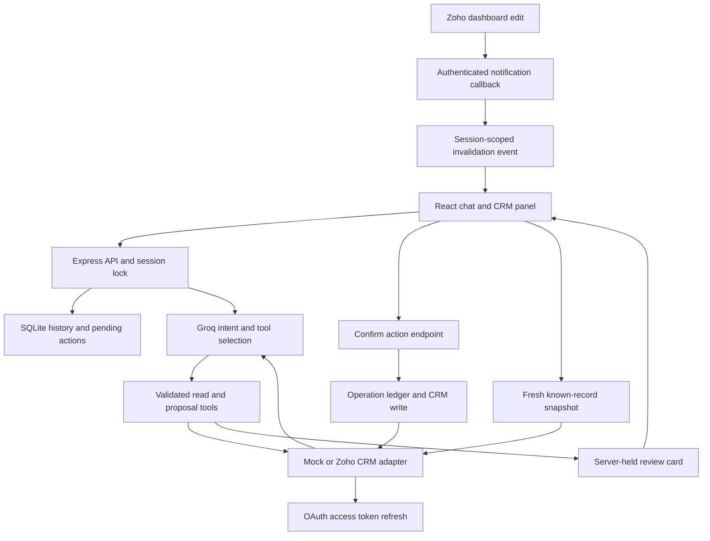
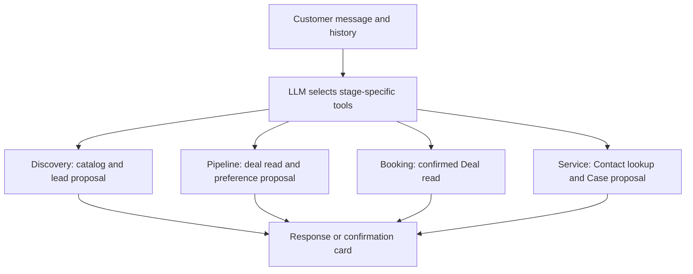

# Architecture

The application separates conversation reasoning from CRM credentials and writes. React owns presentation. Express validates session requests and orchestrates a bounded Groq tool loop. Both CRM adapters expose `search`, `get`, `create`, and `update`, so the same application logic works against fixtures or Zoho.

## Lifecycle routing

## Design decisions

| Decision | Why it fits this assessment |
| --- | --- |
| Direct Groq API integration | Explicitly permitted by the BRD; tool loop and streaming are visible without extra framework abstractions |
| React + Vite, Express, JavaScript | Small dependency set and a readable frontend/backend split |
| Built-in SQLite | Persistent sessions and fixtures without requiring a separate database service |
| Deals for bookings | Uses the BRD's allowed “Closed Won - Booking Done” design and avoids a custom module dependency |
| Structured proposals | LLM cannot execute writes directly; the user confirms exact server-stored data |
| Contact lookup before service | Ensures Cases link to existing Contacts rather than guessed record IDs |
| Fresh reads and notifications | CRM remains authoritative; callbacks carry invalidations rather than trusted business values |
| Synthetic catalog | Demonstrates grounding and explicitly avoids claiming current vehicle prices/specifications |

## Conversation state

Each random 256-bit session bearer maps to stored history, current stage, separate guided-demo slots for each stage, CRM references, and a pending action. Groq receives the current system rules and persisted message history. Tool calls/results remain within a single turn to avoid orphaned tool messages in later requests. A bounded loop allows up to six model calls per turn.

Only references returned by a tool or created by a confirmed action can appear in a session's CRM panel. Follow-up and service proposals must refer to previously looked-up records. This is tool-scope enforcement, not customer identity authentication.

## Failure behavior

- Required arguments and enum choices are checked before tools reach CRM; unknown tools are rejected.
- Access tokens are cached with an expiry margin. Concurrent refresh requests share one promise; a 401 gets one refresh-and-retry.
- CRM GET operations have bounded rate-limit/server-error retries. Ambiguous network failures on writes are not automatically retried.
- The operation ledger records write start, completion or uncertainty. Successful replay returns the stored result. Uncertain operations require reconciliation.
- Webhook token and channel are checked. The server disregards callback record contents and URLs, re-reading through the configured CRM API domain.
- Live changes affect the panel and future answers. Historical assistant messages stay unchanged.
- Groq chunks flow over SSE; deterministic demo answers are sent as one event and are not presented as model token streaming.

## Production extensions

Before using real customer data, add login/OTP, CRM ownership checks, tenant boundaries, retention/deletion, encryption and secret management, a durable notification queue, operation reconciliation, distributed locks, and notification renewal automation. Use approved OEM catalog data and dealer availability systems for real appointment guarantees. These are explicit extensions rather than claims about the take-home implementation.
